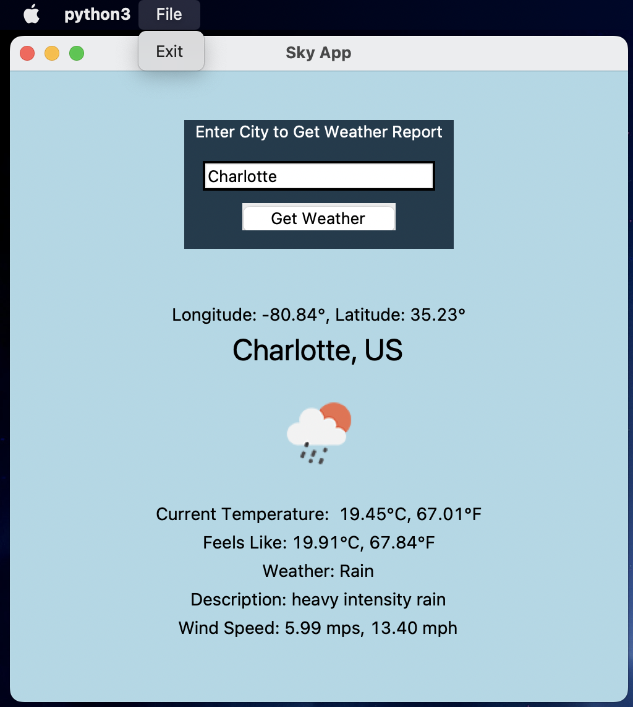

### Python Weather App using TKinter and Open Weather Map API

This project served as an exercise in using an API to retrieve real-time data.

The steps used to complete this project were as follows:  
1. Set up an account at [Open Weather Map](https://openweathermap.org)
2. Select Current Weather Data
3. Copy URL for API Call.  For Example: [https://api.openweathermap.org/data/2.5/weather?q=London&appid={API key}]
4. Obtain an API Key
5. Insert API Key in API Call to obtain response
6. Paste in code from JSON response into formatter for easier viewing of fields
7. Use TKinter to construct GUI
8. Create a search function to search the city. 
9. Use an Entry widget to obtain user input for city name
10. Create a keyboard binding so user may click keyboard return key to display current weather data
11. Create a MenuBar for the app with a File menu that contains an Exit item to Exit the app
12. Obtain weather condition icons from [Open Weather Map Weather Conditions](https://openweathermap.org/weather-conditions)
13. Select all the weather parameters to be used in the app, such as temperature, feels like, weather, description
14. Create a tuple of weather parameters to include the necessary unit conversions
15. Create labels for weather data to be displayed 

